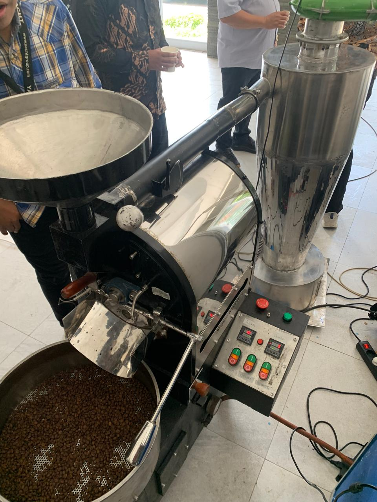
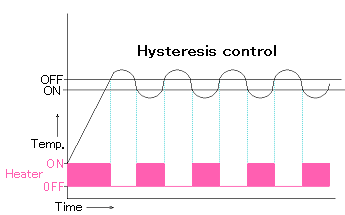
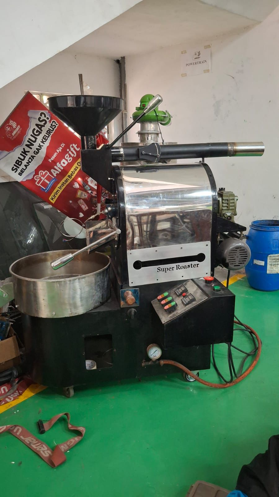
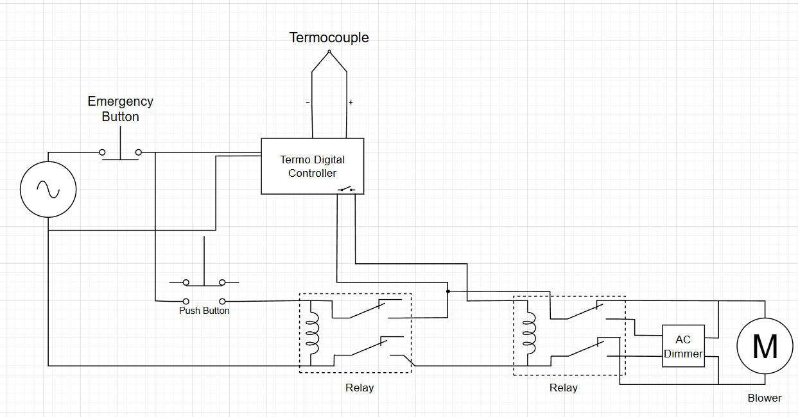
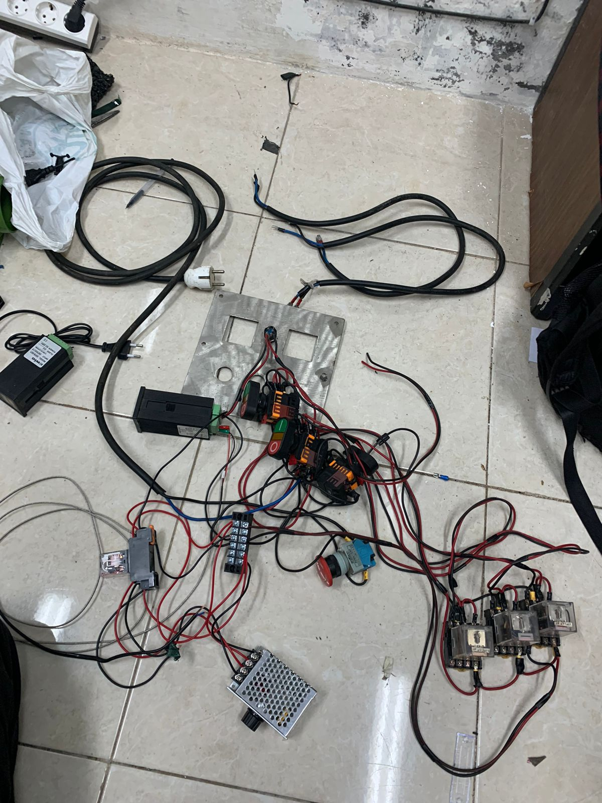

# Industrial Automation Coffee Roaster Machine

## Project Overview

This repository will focus on electrical control system implementation for a 3kg cast iron coffee roaster. The system automates temperature monitoring and hysteresis blower speed control to achieve consistent roasting quality.

<p align="center">
  
  <br>
  <em>Preview Coffee Roaster Machine</em>
</p>


The method being used in this project is hysteresis control, think of hysteresis control like a smart thermostat, but for cooling instead of heating.

<p align="center">
  
  <br>
  <em>Hysteresis Control Illustration</em>
</p>

The picture shows a heater that:
- Turns ON when temperature is too low
- Turns OFF when temperature is high enough

Our blower works the opposite way:
- Turns ON when temperature is too high (above setpoint)
- Turns OFF when temperature is low enough (below setpoint)

Same smart control system, just cooling when hot instead of heating when cold.


---

## Project Objective

- Automate temperature control for consistent roasting
- Improve temperature control stability
- Automate blower adjustment
- Implement safety systems for equipment protection
- Enable precise roasting profiles

---

## Specification Overview

### Control System Architecture

**Input:**
- Type K Thermocouple (0-250°C range)
- Digital Temperature Controller (setpoint adjustment)
- Emergency Stop Button (safety system)

**Control Logic:**
- Digital Temperature Controller (Compares measured temperature against setpoints)
- Relay Output System:
    - Stage 1 (HIGH SPEED): Activates when temperature > setpoint
    - Stage 2 (LOW SPEED): Activates when temperature < setpoint
**Output:** 
- Blower motor speed based on hysteresis control
- Monitoring temperature value

### Key Components

| Component | Specification |
|-----------|---------------|
| Thermocouple | Type K, -200 to +1350°C |
| Motor Control Module | 0-220V output, 3000W capacity |
| Main Breaker | 16A protection |
| RCD Protection | 30mA ground fault |
| Fail-Safe Circuit | Hardware thermal detector |
| Blower Motor | 1HP AC motor |
| Control Setpoint |  adjustable  |

### System Diagram

```
Thermocouple (Drum) 
    ↓
Temperature Reading (0-250°C)
    ↓
Control Logic (Compare to setpoint)
    ↓
Motor Control Module
    ↓
Blower Motor Speed (0-100%)
    ↓
Temperature Control (Maintain with hysteresis control)
```

---

## Result

### Performance Improvement

| Metric | Before | After | Improvement |
|--------|--------|-------|-------------|
| Temperature Controlled | No | Yes | 10x better |
| Control Type | Manual | Automatic | Hands-free |
| System Response | Slow | < 1 second | Immediate |
| Operational Status | Non-functional | Operational | 100+ cycles |

### Testing Data

**Temperature Stability Test:**
- Ramp time to 200°C: ~5 minutes
- Steady-state deviation: ±0.5°C
- Stability period: 15-minute roasting cycle
- Result: Uniform bean color across batch

**Control Response:**
- Below setpoint: Moderate blower speed
- Above setpoint: Full blower engagement

**Safety Verification:**
- Fail-safe triggers
- Emergency stop functional
- All electrical protections verified

---

## Documentation

<p align="center">
  
  <br>
  <em>Final Preview</em>
</p>

<p align="center">
  
  <br>
  <em>Wiring Diagram</em>
</p>

<p align="center">
  
  <br>
  <em>Wiring Testing</em>
</p>

### Included Files

- **README.md** - This file, project overview
- **ELECTRICAL_DOCUMENTATION.md** - System details, wiring, components
- **SETUP_GUIDE.md** - Installation and testing procedures
- **LICENSE** - MIT License

### Key Topics Covered

- Hysteresis control system
- Electrical wiring diagrams
- Component specifications
- Installation procedures
- Testing & calibration methods
- Safety procedures
- Troubleshooting guide
- Maintenance schedule

---

## Tags

`electrical-engineering` `control-systems` `temperature-control` `industrial-electronics` `thermocouple` `blower-control` `coffee-roaster` `automation`

---

## License

MIT License - See LICENSE file for details

---

**Last Updated:** December 2025  
